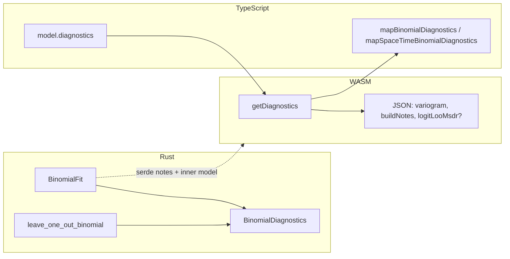

# Change summary: kriging-rs 0.5 architecture + calibrated binomial

This document summarizes the working-tree changes for the **0.5** release in **kriging-rs** and **npm/kriging-rs-wasm**. It is meant for reviewers and downstream integrators who need a single place to understand *what* changed and *why*, without walking every diff hunk.

---

## 1. Executive overview

The work clusters into five themes:

1. **Dual SPD ordinary kriging (ADR-0001)** — Cholesky on the covariance block `C` + `β = C⁻¹·1` replaces bordered LU for ordinary kriging across geographic, projected, and space–time geometries. Enables incremental SGS via `cholesky_extend_spd_lower`.
2. **Generic predictor / simulator harnesses** — [`KrigingPredictor`](../../src/predictor/cv.rs) and [`KrigingSimulator`](../../src/predictor/simulation.rs) replace 36 named Rust CV/simulation entry points. WASM/TS export names unchanged.
3. **Calibrated binomial (0.4 carry-over)** — empirical-Bayes logits, per-site logit observation variance, inflation retries, [`BinomialBuildNotes`](../../src/kriging/binomial.rs), diagnostics, WASM/TS parity.
4. **Incremental SGS coverage** — all continuous and binomial simulator backends use the kriging conditioner; no refit-per-target paths remain.
5. **Domain vocabulary** — [`CONTEXT.md`](../../CONTEXT.md), [ADR-0001](adr/0001-dual-spd-ordinary-kriging.md).

**Prediction models** (`SimpleKrigingModel`, `UniversalKrigingModel`, space–time analogues) now wrap the Cholesky engines; bordered LU is removed from these paths.

---

## 2. Architecture (0.5)

| Seam | Module | Notes |
|------|--------|-------|
| Ordinary engine | `src/kriging/engine.rs`, `src/spacetime/kriging/engine.rs` | Dual SPD; `fit`, `predict`, `condition` |
| Simple engine | `src/kriging/simple_engine.rs`, `src/spacetime/kriging/simple_engine.rs` | SPD Cholesky; prediction + SGS |
| Universal engine | `src/kriging/universal_engine.rs`, `src/spacetime/kriging/universal_engine.rs` | Dual SPD + Schur; constant → ordinary |
| Calibrated binomial build | `src/kriging/binomial.rs` | `build_calibrated_logit_ordinary` — one builder, three geometries |
| Predictor harness | `src/predictor/cv.rs` | `KrigingPredictor::predict_fold` + LOO/k-fold |
| Simulator harness | `src/predictor/simulation.rs` | `KrigingSimulator` + SGS drivers |
| Shrunk facades | `src/cv.rs`, `src/simulation.rs` | Types + `pub use predictor::*` |

---

## 3. Rust crate (`src/`, `tests/`, `examples/`)

### 3.1 Binomial kriging

- Introduces **`BinomialCalibratedResult<T>`** with **`model`** and **`notes: BinomialBuildNotes`**, and **`BinomialFit`** as the geographic specialization.
- **`BinomialDiagnostics`** bundles **`variogram`**, **`build_notes`**, and optional **`logit_loo_msdr`** (from **`leave_one_out_binomial`** + **`BinomialCvSummary`** when count tensors match **`BinomialKrigingModel::len`**).
- **`BinomialCalibratedResult<BinomialKrigingModel>::diagnostics`** implements the native-Rust equivalent of the WASM/TS diagnostics payload.
- Builders (**`new`**, **`new_with_prior`**, **`new_with_config`**, and related precomputed-logit entry points) return the calibrated result type; prediction flows through the inner ordinary kriging on logits with **heteroskedastic diagonal** logic.
- **`finish_binomial_notes`** and related helpers ensure warnings (e.g. inflation) are attached consistently.

### 3.2 Projected and tangent binomial

- **Projected** and **binomial projected** models expose **`variogram()`** and **`len()`** for diagnostics and LOO length checks.
- **Tangent-plane binomial** delegates **`variogram()`** / **`len()`** (and uses existing **reference** handling) so WASM tangent diagnostics can map lat/lon through the model reference and run projected LOO consistently.

### 3.3 Space–time binomial

- **`SpaceTimeBinomialKrigingModel`** gains **`variogram()`** and **`len()`** delegating to the inner **space–time ordinary** model, supporting diagnostics and LOO array validation.

### 3.4 Ordinary kriging (dual SPD engine)

- **`new_with_extra_diagonal`** (and internal helpers) allow a **per-station extra diagonal** on the covariance used by ordinary kriging — the hook binomial calibration uses for logit observation variance.

### 3.5 Cross-validation (legacy types)

- Extensions and consistency work so LOO / summaries align with heteroskedastic binomial behavior and space–time / projected variants used by diagnostics and tests (including dual-scale reporting where applicable).

### 3.6 Variogram fitting

- Calibrated / binomial-aware fitting paths (including behavior exercised by **`fitBinomialVariogram`** on the WASM side and integration tests).

### 3.7 Simulation (`src/predictor/simulation.rs`, `src/simulation.rs`)

- Generic SGS harness with per-geometry **simulator backends** (`OrdinaryGeoSimulator`, `SimpleGeoSimulator`, …).
- Incremental **condition** path for ordinary, simple, binomial, projected ordinary, space–time ordinary/simple, and constant-trend universal.
- Skips duplicate-site append when kriging variance ≤ `1e-10`.
- `src/simulation.rs` retains types (`SimulationOptions`, binomial result structs) and re-exports the harness; dead duplicate helpers removed.

### 3.8 Predictor / CV (`src/predictor/cv.rs`, `src/cv.rs`)

- Generic LOO and k-fold over **`KrigingPredictor::predict_fold(train, test)`** backend structs.
- `src/cv.rs` retains residual/summary types and re-exports the harness.

### 3.9 WASM (`src/wasm/mod.rs`, `src/wasm/spacetime.rs`)

- WASM models carry **`build_notes`** alongside the inner fit where required; **`getBuildNotes`** continues to expose serde’d notes.
- **`getDiagnostics`** on:
  - **`WasmBinomialKriging`** — variogram + build notes + optional LOO MSDR when **`{ lats, lons, successes, trials }`** matches station count.
  - **`WasmBinomialTangentPlaneKriging`** — same JSON shape; LOO uses tangent reference + projected LOO path.
  - **`WasmBinomialProjectedKriging`** — same shape; LOO uses **`{ xs, ys, successes, trials }`**.
- **`WasmSpaceTimeBinomialKriging::getDiagnostics`** returns **`variogram`** (manual JS object for separable / product-sum), **`buildNotes`**, and optional **`logitLooMsdr`** when **`{ lats, lons, times, successes, trials }`** is supplied with consistent lengths.
- Helper functions share logic for binomial diagnostics JSON where possible.

### 3.10 Tests and examples

- **`tests/integration_tests.rs`**, **`tests/regression_simulation.rs`**, **`tests/heteroskedastic_binomial_calibration.rs`**, **`tests/accuracy_speed_harness.rs`**, **`tests/wasm_tests.rs`** — updated for new return types, calibration defaults, and behavior gates.
- **`examples/*.rs`** — small adjustments so examples compile and reflect current APIs.

### 3.11 Minor

- **`src/matrix.rs`** — tiny related fix (e.g. conditioning / numerical edge).
- **`CHANGELOG.md`** — **0.5.0** entry: dual SPD, predictor/simulator API, migration notes.

---

## 5. npm package `kriging-rs-wasm`

### 5.1 Public API and types

- New / expanded types for **calibrated build notes**, **binomial diagnostics**, **`SpaceTimeBinomialDiagnostics`**, **`BinomialDiagnostics`**, CV summaries, and “from fitted” flows that assume **`fitBinomialVariogram`**.
- **`nuggetOverride`** documentation narrowed: **ordinary** `fromFitted*` paths; binomial uses **`fitBinomialVariogram`** for a coherent calibrated pipeline.

### 5.2 Variogram layer

- **`fitBinomialVariogram`** — WASM-backed fit aligned with the **noise-calibrated** empirical variogram used by default binomial kriging.

### 5.3 Interpolation

- **`interpolateBinomialToGrid`** uses **`fitBinomialVariogram`** so one-shot grid interpolation matches the same calibrated logit / variogram assumptions as **`BinomialKriging`**.

### 5.4 Binomial class wrappers

- **`BinomialKriging`**, **`BinomialProjectedKriging`**, **`BinomialTangentPlaneKriging`**, **`SpaceTimeBinomialKriging`**:
  - **`getBuildNotes`** / **`buildNotes`** accessors.
  - **`diagnostics()`** calling WASM **`getDiagnostics`** with the appropriate coordinate/count payload; throws **`KrigingError`** if the loaded `pkg` predates **`getDiagnostics`**.

### 5.5 Mappers

- **`mapBinomialDiagnostics`** for geographic/projected/tangent payloads.
- **`mapSpaceTimeBinomialDiagnostics`** + **`mapSpaceTimeVariogramParamsFromDiagnostics`** for ST **`family`**, **`spatial`**, **`temporal`**, and product-sum **`k1`/`k2`/`k3`**.

### 5.6 WASM instance shapes

- Optional **`getDiagnostics?`** on **`WasmBinomialInstance`**, **`WasmBinomialProjectedInstance`**, **`WasmSpaceTimeBinomialInstance`**.
- **`fitBinomialVariogram`** entry in the raw module shape.

### 5.7 Prior helpers

- Adjustments so prior handling stays consistent with **default `Beta(1,1)`** and explicit priors across preprocess / fit / model.

### 5.8 README

- Documents **binomial `fromFittedVariogram*`** with **`fitBinomialVariogram`**, prior matching, and related migration notes.

### 5.9 Tests

- Integration coverage for **`fitBinomialVariogram`**, **`interpolateBinomialToGrid`** vs manual pipeline, **diagnostics** (geo, tangent, projected, space–time), and TypeScript **contracts** / compile-time checks against the public surface.

---

## 6. Breaking changes and migration (concise)

| Area | Before | After |
|------|--------|--------|
| Rust CV / SGS (0.5) | Named `leave_one_out_*`, `k_fold_*`, `conditional_simulate_*` | **`KrigingPredictor`** / **`KrigingSimulator`** backends + generic harnesses |
| Ordinary prediction numerics (0.5) | Bordered LU | Dual SPD Cholesky; small **`f32`** drift possible |
| Rust binomial constructors | Returned `BinomialKrigingModel` (or similar) directly | Return **`BinomialCalibratedResult<…>`**; use **`.model`** / **`.into_model()`** / **`Deref`** |
| Default binomial prior | May have differed by call site | **Default `Beta(1, 1)`** when omitted; use explicit **Jeffreys** if you need **`0.5/0.5`** |
| TS binomial variogram fit | Often `fitVariogram` on logits | Prefer **`fitBinomialVariogram`** for count data; then **`fromFittedVariogram*`** |
| TS `nuggetOverride` on binomial from-fitted | Was documented / allowed in some types | **Ordinary only**; binomial path uses **`fitBinomialVariogram`** |
| WASM `pkg` | Older builds without `getBuildNotes` / `getDiagnostics` | **Rebuild** `pkg` for **`getBuildNotes`**, **`getDiagnostics`**, zero-trial dropping, and validation behavior |

---

## 7. How diagnostics fit together (end-to-end)

- **Without counts:** variogram + build notes only (LOO MSDR omitted).
- **With aligned count tensors:** LOO refits per held-out site (heteroskedastic inflation per fold where applicable) and reports **logit MSDR** on the returned payload.

---

## 8. Files touched (reference)

High-impact paths:

| Path | Role |
|------|------|
| `src/kriging/binomial.rs` | Calibrated result type, diagnostics, heteroskedastic OK path |
| `src/kriging/ordinary.rs` | `new_with_extra_diagonal` |
| `src/projected.rs` | Projected/tangent binomial accessors + calibration wiring |
| `src/spacetime/kriging/binomial.rs` | ST binomial accessors |
| `src/wasm/mod.rs` | WASM binomial + projected + tangent diagnostics |
| `src/wasm/spacetime.rs` | ST binomial diagnostics + variogram JS helper |
| `src/cv.rs`, `src/simulation.rs`, `src/variogram/fitting.rs` | CV, SGS, fitting alignment |
| `npm/kriging-rs-wasm/src/types.ts`, `variogram.ts`, `interpolate.ts`, `kriging/*.ts`, `spacetime/binomial.ts` | TS API + facades |
| `npm/kriging-rs-wasm/tests/integration.test.ts`, `tests/contracts.ts` | Behavior + type contracts |

---

## 9. Verification performed

- **`cargo test`** (full crate + integration + wasm test harness where applicable).
- **`npm run build`** in `npm/kriging-rs-wasm` (includes **`wasm-pack`** with `--features wasm` and **`tsc`**).
- **`npm test`** (Vitest), including new diagnostics tests.

---

*Generated to describe the state of the repository’s cumulative changes on this workstream; adjust section numbers or file lists if you split the work into multiple PRs.*
